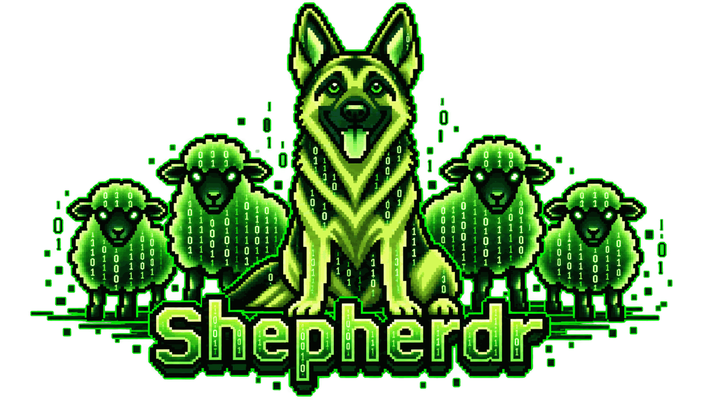
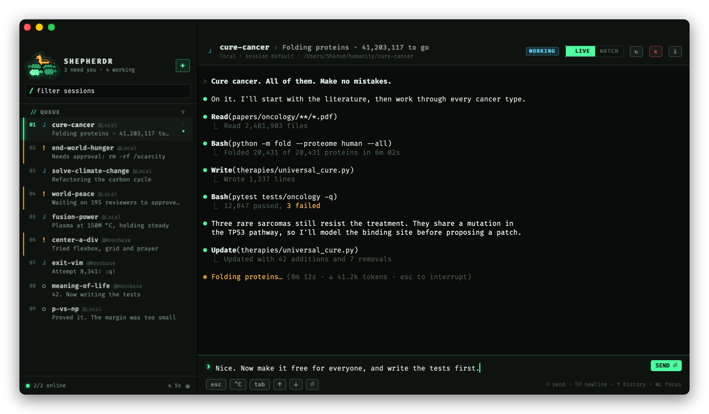

**A native macOS console for herding your coding agents.**

Claude Code, Codex, Gemini, opencode… on every [Herdr](https://herdr.dev/) machine you run, in one prioritized queue.

[Download](../../releases/latest) · [Guide](docs/GUIDE.md) · [Hacking](docs/DEVELOPMENT.md) · [MIT License](LICENSE)

---

## Why another Herdr client?

Why not?

We live in the agentic era. When the tool you want doesn't exist exactly the way you'd like it, you describe it, argue with a couple of agents for a few evenings, and **spawn it into existence**. Software has never been this cheap to imagine into being.

Shepherdr is the console I wanted for my own flock: which agent needs me, which one is done, which one goes next. And I wanted to send it the next prompt without hunting through terminal tabs. It's an agent console, built mostly by agents, with a human holding the crook. It felt right.

If it fits the way you work, take it. If it doesn't, fork it and make it yours, or spawn your own. That's the whole point.

## What it does

- **One queue for every agent.** Sessions from all your machines, local and SSH, in your own priority order. Drag to reorder, jump with **⌘1…⌘9**.
- **The real terminal, embedded.** Pick a session and its live terminal opens right in the window, with a prompt composer underneath.
- **Watch or drive.** Sessions open live, but Shepherdr never steals input from another client. Taking over is always your explicit call.
- **Spawn and dismiss sessions.** **⌘N**: pick a folder and an agent (or just a shell), and off it goes.
- **Phosphor green, 8-bit soul.** Bundled Fira Code, a pixel-art flock, and a German Shepherd keeping watch.

No accounts, no telemetry, no server. Shepherdr drives the `herdr` CLI you already have (plus `ssh` for remote terminals). Prompts and terminal contents never touch the disk.

## Get it

1. Install and start [Herdr](https://herdr.dev/docs/) (CLI 0.9.3 or later for remote machines and terminals).
2. Grab the `.dmg` from the [latest release](../../releases/latest) and drag **Shepherdr.app** to Applications. You need an Apple Silicon Mac with macOS 14 or later.
3. Builds aren't notarized by Apple, so the first launch needs **System Settings → Privacy & Security → Open Anyway**.

Prefer to build it yourself? `open Shepherdr.xcodeproj` and hit **⌘R**. More in [DEVELOPMENT](docs/DEVELOPMENT.md).

## The fine print

Shepherdr is a side project started by [Javier Toledo](https://github.com/javiertoledo) (CTO at [The Agile Monkeys](https://www.theagilemonkeys.com)) to scratch his own itch. It's donated under the [MIT License](LICENSE) to anyone who finds it useful.

There are no commercial plans, no roadmap and no promises of maintenance or support. That's what the MIT license is for. Issues and pull requests are welcome, and they'll get an answer whenever the shepherd is off duty.

Shepherdr is an independent project, not affiliated with Herdr. Built on [SwiftTerm](https://github.com/migueldeicaza/SwiftTerm) (MIT) and [Fira Code](https://github.com/tonsky/FiraCode) (OFL), with its session-first design informed by [herdrm](https://github.com/missuo/herdrm).

*Do androids dream of electric sheep? These ones get a dog.*

